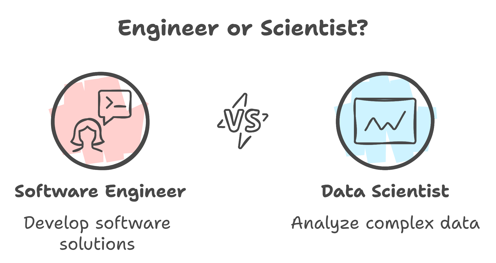

# From Software Engineer to Data Scientist: My Journey through Syracuse University’s Applied Data Science Program

Transitioning from Computer Science and Engineering to a career in Applied Data Science has been a transformative experience, shaped by my time at Syracuse University's iSchool. This portfolio highlights my journey through the Master’s in Applied Data Science program, detailing the skills I gained and the projects I completed that prepared me for the data-driven world. Here’s a look at what led me to choose this degree, the program’s impact, and the real-world applications of my learning.

## Why Syracuse University’s iSchool?

When considering graduate programs, I was drawn to the iSchool for its well-defined, structured path toward a career in data science. The iSchool’s Master’s program aligned perfectly with my career goals, providing a balanced mix of technical and managerial courses across tracks like Artificial Intelligence, Big Data Analytics, Business Analytics, and Visual Analytics. Additionally, its partnership with the Whitman School of Management gave me access to essential business insights, preparing me not only to meet industry standards but also to excel.

## Building a Strong Foundation: Core and Elective Courses

In the program, I completed a set of core courses that gave me a foundation in predictive modeling, data handling, and analytics:

- **IST 707: Applied Machine Learning** and **IST 687: Introduction to Data Science** introduced me to machine learning techniques, data wrangling, and model-building, which I applied in projects like *Crime Classification Based on Geographical Location*.
- Elective courses like **IST 615: Cloud Management** allowed me to explore cloud-based data solutions, and **MBC 638: Data Analysis and Decision Making** strengthened my decision-making frameworks.
- I selected the AI track, which included **IST 664: Natural Language Processing** and **IST 692: Responsible AI**. This specialization deepened my understanding of machine learning and ethical practices in AI, skills that I applied in my *Movie Reviews Sentiment Analysis* project.

## Applying Learning to Real-World Projects

The program emphasized hands-on projects, each aligned with core data science outcomes. Here are a few highlights:

- **NBA Analytics (IST 652: Scripting for Data Analysis)**: This project aimed to analyze NBA player performance to predict awards like MVP and Defensive Player of the Year. Using Python and visualization tools, I developed a regression model to predict key player metrics, offering actionable insights for team strategy.

- **Movie Reviews Sentiment Analysis (IST 664: Natural Language Processing)**: In this project, I classified movie reviews by sentiment to understand customer feedback. By using advanced NLP models like BERT, I was able to enhance sentiment detection accuracy, showcasing the power of machine learning for analyzing customer sentiment.

- **Text-to-Speech Converter (IST 615: Cloud Management)**: Leveraging AWS services, I created a cloud-based text-to-speech application designed to be accessible to visually impaired users. This project demonstrated the advantages of serverless architecture in building scalable, accessible solutions.

- **Taxi Fare Predictor (IST 718: Big Data Analytics)**: By analyzing NYC taxi trip and weather data, I built a model to predict taxi fares. Using PySpark and BigQuery, I identified factors like trip distance and weather conditions that influence fares, providing insights for optimized pricing strategies.

- **Crime Classification Based on Geographical Location (IST 707: Applied Machine Learning)**: This project involved classifying and visualizing crime across Los Angeles neighborhoods using clustering. The resulting crime map provided valuable insights for public safety agencies and informed residents about localized crime trends.

## Reflecting on the Program’s Impact

This program offered both theoretical knowledge and practical applications, preparing me for the challenges of a data science career. A few challenges stood out:

- **Managing Large Datasets**: In the *Taxi Fare Predictor* project, I learned how to optimize data pipelines for large datasets, using PySpark for efficiency.
- **Fine-Tuning NLP Models**: Extensive experimentation and hyperparameter tuning in the *Movie Reviews Sentiment Analysis* project highlighted the complexity of NLP, strengthening my skills in deep learning.

These experiences have prepared me well for data science roles, equipping me with tools to handle data processing, predictive modeling, and cloud solutions across various industries.

## Key Takeaways and Future Directions

**Takeaways**:
- **Data Science Life Cycle**: The program gave me a solid understanding of the entire data science life cycle, from data collection to model deployment, which I applied in projects like *NBA Analytics*.
- **Technical Proficiency**: Working with AWS, PySpark, and TensorFlow helped me build a versatile toolkit for tackling data science challenges.
- **Ethical Data Science**: Through courses like Responsible AI, I developed a strong foundation in ethical data practices, which I applied in the *Movie Reviews Sentiment Analysis* project to reduce biases.

**Future Directions**: I’m eager to expand my knowledge in deep learning, particularly in computer vision and advanced NLP, with applications in healthcare and social media. Additionally, I plan to enhance my skills in cloud-native data science to build scalable, distributed systems for handling large datasets.

## Final Reflections on the Master’s Program Journey

The Master’s in Applied Data Science has been a transformative experience. It provided a well-rounded foundation in data science, combining rigorous academics with hands-on projects that spanned from business analytics to AI. I leave this program with a profound appreciation for data’s potential and the ethical responsibilities it entails, fully prepared to make a meaningful impact in my field.

## References

https://github.com/jovitaand/Sentimental-Analysis-on-Movie-Reviews-

https://github.com/jovitaand/NBA-Analytics

https://github.com/jovitaand/Cloud-Management

https://github.com/jovitaand/Crime-Classification-based-on-Geographical-Area

https://github.com/jovitaand/NYC-Taxi-Trip-Analysis

